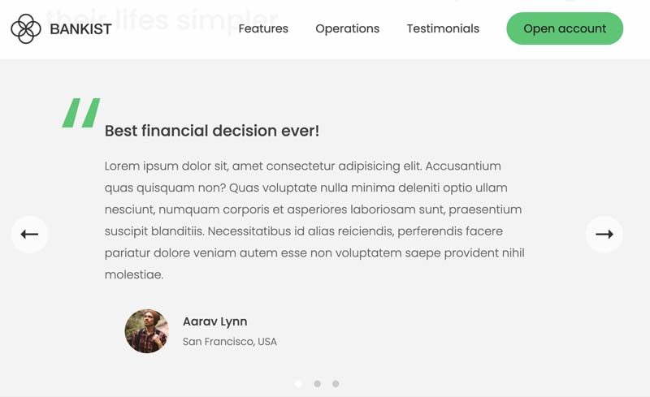

# js-bankist-home

Vanilla JS homepage that is commonly used for product websites.

This one showcases the following UI functionality:

- Sticky Nav Bar
- Menu Fade on Hover
- Lazy Loading Images
- Nav Links Scroll to Sections
- Show Hidden Sections
- Single Link Scroll into View
- Modal Window
- Tabbed Components
- Image Slider with Arrows and Dots

## How Its Done
- Lots of event listeners for click, keydown, mousover, mouseout, load.
- Dom manipulation using classList, 
- Looping through node lists using forEach()
- Scrolling using scrollIntoView()
- Using new IntersectionObserver(callback, options object) API

